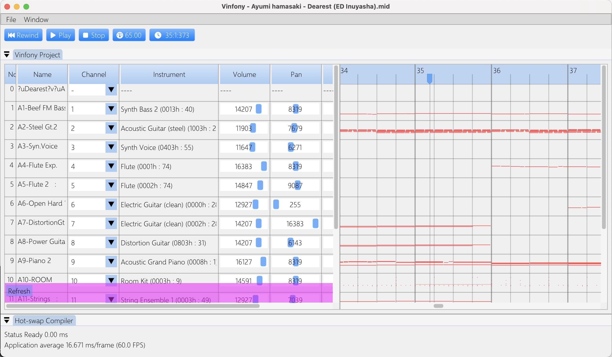

# vinfony

MIDI Music Creator

Video:
[](https://youtu.be/HHwiREK-5zc?si=sXR79DU0YB6-c6T9)

## Development

```bash
$ git clone THIS_REPO_URL
$ cd THIS_REPO_DIR
$ git submodule update --init
$ python -m venv .venv
$ source .venv/bin/activate
$ pip install -r kosongg/requirements.txt
$ python kosongg/main.py
$ python run.py
```

For Arachno SoundFont update `./configs/vinfony.ini` file.

## Dev Notes

**IMGUI**: How to store state (globally) when not using class/instances.

```c++
#define EMPTY_REF -1

static ImGuiID g_lastPianoButtonID{0};

const char * label = "piano";
ImGuiID pianoID = ImGui::GetID(label);
int *pianoStorageID = ImGui::GetStateStorage()->GetIntRef(pianoID, EMPTY_REF);

if (*pianoStorageID == EMPTY_REF) {
    // SetState
    *pianoStorageID = 1;
}

g_lastPianoButtonID = *pianoStorageID;
```

**IMGUI**: Get current window and scoped.

```c++
ImGuiContext& g = *GImGui;
ImGuiWindow* window = g.CurrentWindow;
const ImGuiID id = window->GetID(label);
int * storageIdx = window->StateStorage.GetIntRef(id, EMPTY_REF);
```
